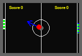
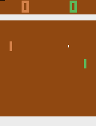
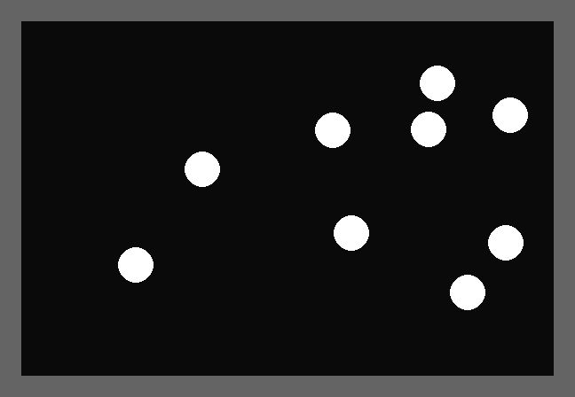

# games-llm
Pong and Random LLM Stuff

### Images from PONG

This image comes from the code found in the 'src/games' folder. Here I've tried to get an LLM to play Ping Pong. The first image is included to show the size of the game field, and show the basic operation of the paddles. There is an arrow in the image that points in the direction of the movement of the ball.

Making this image, the LLM was not used. For this reason the right paddle does not move. During actual testing the LLM is controlling the right paddle.

Another screenshot. This shot uses the Arari 2600 version of Pong.

Another image. This is from `pygame_dots.py` 

There are 9 dots in this image.

### Notes:

add yourself to the 'input' group.

> sudo usermod -a -G input $USER
